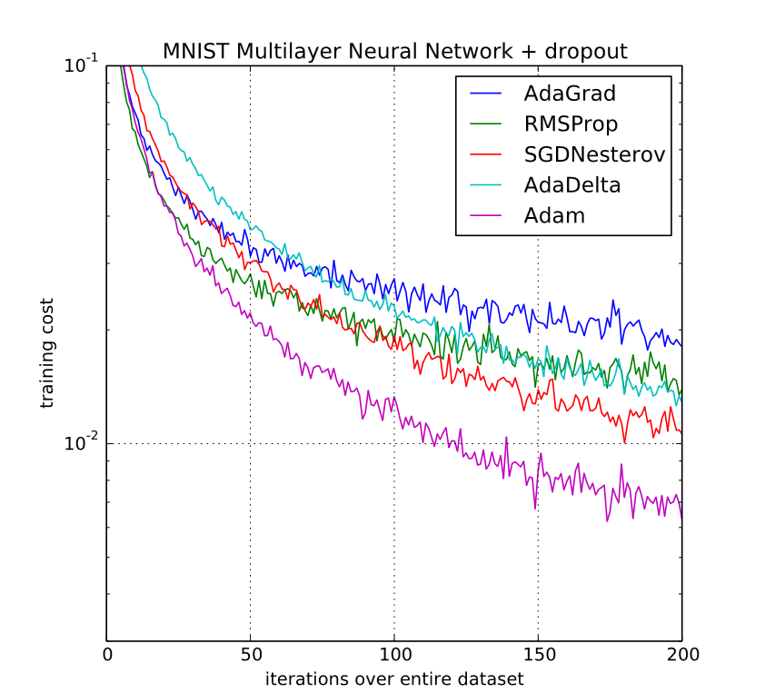

**Subject**: Adam: A Method for Stochastic Optimization — Kingma & Ba (2015) [arXiv:1412.6980](https://arxiv.org/abs/1412.6980)
**Authors**: Artur Pozniak & Artsiom Pipchanka

---
# Abstract
This report presents a reproduction study of *"Adam: A Method for Stochastic Optimization"* by Kingma & Ba (2015), published at ICLR 2015. Adam is a first-order stochastic optimization algorithm that computes individual adaptive learning rates for each parameter using exponential moving averages of the gradient and its square. We re-implement Adam from scratch alongside three baseline optimizers: SGD with Nesterov momentum, AdaGrad, and RMSProp . We attempt to reproduce Figures 1–4 of the original paper across three model classes: logistic regression on MNIST, a multi-layer perceptron on MNIST, and a convolutional neural network on CIFAR-10. We additionally investigate the authors' bias-correction mechanism through a dedicated ablation study. All results are compared directly against those reported in the original work, and discrepancies are documented alongside reproducibility notes.

# Paper summary
The paper introduces **Adam** (*adaptive moment estimation*), a new algorithm for gradient-based optimization of stochastic objective functions. Adam is designed to combine the strengths of two previously popular adaptive methods - **AdaGrad** and **RMSProp**, each of which improves on vanilla SGD but introduces its own limitations. The paper's central claim is that Adam outperforms competing methods across a variety of models and datasets. We treat this claim as a hypothesis and attempt to verify it through direct reproduction of the headline experiments.
## So how does Adam work?
Adam maintains two exponential moving averages per parameter at each step $t$: the **first moment** $\mathbf{m}_t$ and the **second raw moment** $\mathbf{v}_t$.

**The first** moment is a smoothed estimate of the gradient direction, analogous to the momentum term in SGD with momentum. Rather than following the raw (often noisy) gradient at each step, Adam follows a weighted average of recent gradients, which reduces oscillations and accelerates convergence along consistent directions.

**The second** moment tracks the magnitude of recent gradients for each parameter individually. A parameter whose gradients have been consistently large will accumulate a large $v_{t,i}$, which causes its effective step size to shrink. This is the adaptive learning rate mechanism inherited from RMSProp.

The parameter update divides the (bias-corrected) first moment by the square root of the (bias-corrected) second moment:

$$\mathbf{w}_{t+1} = \mathbf{w}_t - \frac{\eta\,\hat{\mathbf{m}}_t}{\sqrt{\hat{\mathbf{v}}_t} + \epsilon}$$

Intuitively, the ratio $\hat{m}_{t,i}/\sqrt{\hat{v}_{t,i}}$ approximates the **signal-to-noise ratio (SNR)** of the gradient for parameter $i$. When the gradient consistently points in one direction (high signal, low noise), the SNR is large and Adam takes a meaningful step. When the gradient is noisy and inconsistent near an optimum, the SNR approaches zero and the effective step size shrinks automatically. This is a form of built-in learning rate annealing that requires no manual schedule.

The key differences from its predecessors are:
- **vs. AdaGrad**: Adam uses an exponential moving average of squared gradients rather than their cumulative sum. This prevents the learning rate from decaying monotonically to zero and makes Adam viable for long training runs and non-stationary objectives.
- **vs. RMSProp**: Adam additionally tracks the first moment (momentum) and applies *bias correction* to both estimates before computing the update. The paper shows that Adam with $\beta_1 = 0$ and no bias correction reduces to RMSProp with momentum, and that Adam with $\beta_1 = 0$, infinitesimal $(1-\beta_2)$, and a $1/\sqrt{t}$ learning rate schedule recovers AdaGrad exactly.
*Adam can thus be understood as a generalization of both.*
## Bias correction
When the moment vectors are initialized to $\mathbf{m}_0 = \mathbf{0}$ and $\mathbf{v}_0 = \mathbf{0}$  as *Algorithm 1* pseudo code suggests, the running averages are heavily biased towards zero in the early steps of training, particularly when the decay rates $\beta_1$ and $\beta_2$ are close to 1. This happens because the EMA starts from zero rather than from the true distribution of gradients, and it takes many steps for the accumulated history to "warm up".

To see the effect concretely, consider the second moment at $t = 1$ with the default $\beta_2 = 0.999$:

$$v_1 = (1 - \beta_2)\,g_1^2 = 0.001 \cdot g_1^2$$

Without correction, $\sqrt{v_1} \approx 0.032\,|g_1|$, which inflates the effective step size by a factor of roughly $31\times$ relative to the intended learning rate $\eta$. With bias correction, $\hat{v}_1 = v_1/(1 - \beta_2^1) = g_1^2$, and the step is properly bounded by $\eta$. The same inflation occurs in the first moment estimate, compounding the problem.

Formally, as shown in Section 3 of the paper, the expected value of $v_t$ satisfies:

$$\mathbb{E}[v_t] = \mathbb{E}[g_t^2] \cdot (1 - \beta_2^t) + \zeta$$

where $\zeta \approx 0$ when the true second moment is approximately stationary. Dividing by $(1 - \beta_2^t)$ yields a nearly unbiased estimate of the true second moment. The correction factor vanishes as $t \to \infty$ (since $\beta_2^t \to 0$), so it only has a meaningful impact in the early steps of training. However, it is precisely in those early steps and with large values of $\beta_2$, which are required for robustness with sparse gradients where the uncorrected version produces dangerously large updates and can cause divergence.

The paper empirically demonstrates this effect in Section 6.4, showing that removing bias correction leads to instability during training when $\beta_2$ is close to 1. We reproduce this ablation in the dedicated section below.

---
# Testing Adam performance
The authors evaluated Adam on three progressively complex model classes: logistic regression, multi-layer fully connected neural networks, and convolutional neural networks. In all experiments, hyperparameters for each optimizer were selected via a dense grid search and the best-performing configuration was reported. We follow this protocol where computationally feasible and document our specific choices where the paper is ambiguous.

**Hardware**: 
	NVIDIA RTX 3090 (24 GB VRAM) - used for training
	Ryzen 9 3900x
	RAM 64GB DDR4 3200MHz CL16
	Linux cachyos 7.0.12-1-cachyos
**Python**: Python 3.14.5 with GIL
**Pytorch**: 2.12.1
**Cuda toolkit**: 13.0.2

## Reproducibility
Several implementation details are absent from the paper or underspecified:

- The exact hyperparameter search grid for AdaGrad and SGD with Nesterov momentum is not reported; the paper states only that a "dense grid" was used and the best result is shown.
- The L2 regularization coefficient for logistic regression is not specified.
- The weight initialization scheme is not mentioned for any model.
- The exact number of training epochs is not stated; it can be inferred approximately from the x-axes of Figures 1–3.
- For CIFAR-10, the paper mentions input whitening but gives no preprocessing details (e.g., per-pixel or ZCA whitening).
- The SFO optimizer (Sohl-Dickstein et al., 2014), used in Figure 2(b), is not re-implemented in this study due to its complexity and the fact that it is not central to the paper's main claims about Adam.
- The paper reports training cost (negative log-likelihood), not validation loss. All our plots show training cost accordingly.

Where the paper is silent, we state our choices explicitly below and mark them with *(our choice)*.

## Logistic regression

The first experiment evaluates Adam on L2-regularized multi-class logistic regression. Because logistic regression has a convex objective, local minima are not a concern and the comparison isolates the effect of the optimizer alone. Two sub-experiments are reported in Figure 1 of the paper.

### MNIST (dense features)

The logistic regression model classifies MNIST images directly on the 784-dimensional pixel vectors.

| Parameter                         | Value                                  | Source                            |
| --------------------------------- | -------------------------------------- | --------------------------------- |
| Dataset                           | MNIST (60k train / 10k test)           | paper                             |
| Minibatch size                    | 128                                    | paper                             |
| Learning rate schedule            | $\alpha_t = \alpha / \sqrt{t}$         | paper                             |
| Adam $\alpha$                     | 0.1                                    | *(grid search)*                   |
| Adam $\beta_1, \beta_2, \epsilon$ | 0.9, 0.999, 10⁻⁸                       | paper (default)                   |
| SGD momentum                      | 0.9                                    | *(our choice)*                    |
| L2 regularization $\lambda$       | 1×10⁻⁴                                 | *(our choice)*                    |
| AdaGrad / SGDNesterov $\alpha$    | grid search over {0.01, 0.1, 0.3, 1.0} | *(our choice, paper unspecified)* |
| training epochs                   | 45                                     | inferred from Fig. 1 x-axis       |
*Figure 1 from the original paper* shows that SGDNesterov converges just a tiny bit slower than Adam while AdaGrad performs significantly worse:
![[Pasted image 20260626161458.png|706]]
Our reproduction of this experiment shows almost identical plots from Adam and SGDNesterov, while for some reason (probably because of unspecified $\alpha$) AdaGrad's curve looks a bit off, but still shows the same trend:![[fig1_reproduction_left.png]]
### IMDB bag-of-words (sparse features)

This sub-experiment uses sparse bag-of-words (BoW) features to test the optimizers in a regime where AdaGrad's per-feature adaptation is most valuable.

| Parameter | Value | Source |
|---|---|---|
| Dataset | IMDB movie reviews (25k train / 25k test) | paper |
| Feature representation | BoW, top 10,000 most frequent words | paper |
| Input dropout | 50% | paper |
| Minibatch size | 128 | paper (implied same as above) |
| Optimizers compared | Adam, AdaGrad, RMSProp, SGDNesterov (all with dropout) | paper |
| Learning rate schedule | $\alpha_t = \alpha / \sqrt{t}$ | paper |
| Approximate training epochs | ~160 | inferred from Fig. 1 x-axis |

> [!TODO]
> Run: Adam+dropout, AdaGrad+dropout, RMSProp+dropout, SGDNesterov+dropout.  
> Plot: **training negative log-likelihood per sample** (y-axis, range ≈ 0.20–0.50) vs. **epochs** (x-axis, range 0–160).  
> Expect large oscillations in early training due to dropout noise — this is normal and visible in the paper's plot.  
> Expected shape: AdaGrad significantly outperforms SGDNesterov; Adam converges approximately as fast as AdaGrad; RMSProp also competitive.  
> **Compare with Figure 1 (right) from the paper.**  
> Caption: *"Reproduction of Figure 1 (right) in Kingma & Ba (2015). Logistic regression training cost on IMDB movie reviews with 10,000 BoW features and 50% input dropout."*

> [!TODO]
> **Reproducibility note:** IMDB BoW is the most ambiguous experiment in the paper. If this sub-experiment proves too costly or unstable to reproduce faithfully, it can be acknowledged as a deviation in the Reproducibility section and omitted from the final figures, since it is not required for the headline claim.

## Multi-layer neural networks

The second experiment uses a two-layer fully connected network on MNIST. This introduces a non-convex objective and dropout regularization, testing whether Adam's empirical advantages hold beyond convex settings.

| Parameter                     | Value                                          | Source                         |
| ----------------------------- | ---------------------------------------------- | ------------------------------ |
| Dataset                       | MNIST (60k train / 10k test)                   | paper                          |
| Architecture                  | 2 hidden layers × 1000 units, ReLU activations | paper                          |
| Minibatch size                | 128                                            | paper                          |
| Regularization (stochastic)   | dropout                                        | paper                          |
| Loss                          | cross-entropy                                  | paper                          |
| Optimizers (stochastic)       | Adam, AdaGrad, RMSProp, SGDNesterov, AdaDelta  | paper                          |
| Training epochs               | 200                                            | inferred from Fig. 2(a) x-axis |
| Loss function (deterministic) | cross-entropy + L2 weight decay                | paper                          |
| Dropout rate                  | 0.5                                            | *(our choice)*                 |
| L2 weight decay $\lambda$     | 1×10⁻⁴                                         | *(our choice)*                 |
| Weight initialization         | Glorot uniform                                 | *(our choice)*                 |
We've ran grid search for learning rates $\alpha$ as paper suggests:
- Adam over $\{10^{-4}, 10^{-3}, 10^{-2}\}$; Best result was achieved with $\alpha=10^{-4}$
- SGDNesterov over $\{10^{-2}, 10^{-1}, 0.3, 1.0\}$; Best result was achieved with $\alpha=10^{-2}$
- AdaGrad over $\{10^{-3}, 10^{-2}, 10^{-1}, 0.3\}$; Best result was achieved with $\alpha=10^{-2}$
- RMSProp over $\{10^{-4}, 10^{-3}, 10^{-2}\}$; Best result was achieved with $\alpha=10^{-4}$
- AdaDelta (scaling factor) over $\{0.1, 1.0, 5.0\}$; Best result was achieved with $10^{-1}$

**Problem:**
Section 6.2 of the paper explicitly says: _"the standard deterministic cross-entropy objective function with L2 weight decay on the parameters to prevent over-fitting."_ It does not explicitly say whether L2 is also applied in the stochastic case. We've decided to use $10^{-4}$ decay as in first experiment. 
Same applies to normalization which we decided to also use.

**Original figure (2a)**

## Convolutional neural networks

The third experiment uses a convolutional network on CIFAR-10. Unlike fully connected networks, CNNs exhibit highly varying gradient magnitudes across layers, making per-parameter learning rate adaptation particularly relevant.

| Parameter              | Value                                                       | Source                      |
| ---------------------- | ----------------------------------------------------------- | --------------------------- |
| Dataset                | CIFAR-10 (50k train / 10k test, 32×32 RGB)                  | paper                       |
| Architecture           | 3× [5×5 conv → 3×3 max-pool (stride 2)], FC 1000 units ReLU | paper                       |
| Filter counts          | 64, 64, 128 (c64-c64-c128-1000)                             | paper (figure caption)      |
| Input preprocessing    | whitening                                                   | paper                       |
| Dropout                | applied to input layer and FC layer                         | paper                       |
| Minibatch size         | 128                                                         | paper                       |
| Optimizers             | Adam, AdaGrad, SGDNesterov (with and without dropout)       | paper                       |
| Training epochs        | 45                                                          | inferred from Fig. 3 x-axis |
| Exact whitening method | per-channel mean subtraction + std normalization            | *(our choice)*              |
| Dropout rate           | 0.5 on FC, 0.2 on input                                     | *(our choice)*              |
| Weight initialization  | Kaiming uniform                                             | *(our choice)*              |

> [!TODO]
> Two sub-plots are needed, corresponding to Figure 3 (left) and (right).  
> **Plot 3(left):** Training cost (linear scale, y-axis ≈ 0.5–3.0) vs. epochs (x-axis, 0–3) — first three epochs only. This tests early convergence speed.  
> **Plot 3(right):** Training cost (log scale, y-axis ≈ 10⁻⁴ to 10²) vs. epochs (x-axis, 0–45) — full training run.  
> Expected shape: Adam and AdaGrad both converge quickly at first; over long training, Adam and SGDNesterov pull ahead of AdaGrad significantly.  
> The paper notes that $\hat{v}_t$ vanishes after a few epochs in the CNN setting, making the first moment (momentum) the dominant factor. This is consistent with Adam offering only marginal improvement over SGDNesterov in this experiment.  
> **Compare with Figure 3 from the paper.**  
> Caption: *"Reproduction of Figure 3 in Kingma & Ba (2015). Training cost of a CNN on CIFAR-10 with c64-c64-c128-1000 architecture. Left: first three epochs. Right: full 45-epoch run."*
---

---
# Bias correction ablation 
As discussed in the Paper Summary, Adam's bias correction terms $1 - \beta_1^t$ and $1 - \beta_2^t$ are what formally distinguish it from RMSProp with momentum: removing them recovers that simpler algorithm exactly. The paper argues that the correction is critical when $\beta_2$ is close to 1, because the second moment EMA starts near zero and inflates effective step sizes dramatically in the early steps of training. This section reproduces the ablation reported in Section 6.4 of the paper and extends it with additional analysis of the mechanism itself.

## Reproducing Figure 4 (VAE experiment)

The authors train a Variational Autoencoder (VAE) following the architecture of Kingma & Welling (2013): a single hidden layer of 500 units with softplus activations and a 50-dimensional spherical Gaussian latent space. They train Adam both with and without bias correction across a grid of $\beta_1$, $\beta_2$, and $\alpha$ values, measuring the resulting training loss at two checkpoints: after 10 epochs and after 100 epochs.

| Parameter | Value | Source |
|---|---|---|
| Dataset | MNIST (60k train) | implied from Kingma & Welling 2013 |
| Architecture | encoder: FC 500 softplus → $\mu$, $\log\sigma$; decoder: FC 500 softplus → 784 sigmoid | Kingma & Welling 2013 |
| Latent dimension | 50 | paper |
| $\beta_1$ sweep | {0, 0.9} | paper |
| $\beta_2$ sweep | {0.99, 0.999, 0.9999} | paper |
| $\log_{10}(\alpha)$ sweep | {-5, -4, -3, -2, -1} | paper |
| Evaluation checkpoints | 10 epochs, 100 epochs | paper |
| Minibatch size | 128 | *(our choice, paper unspecified)* |
| Loss | ELBO (reconstruction + KL) | standard for VAE |

> [!TODO]
> Run the full $\beta_1 \times \beta_2 \times \alpha$ grid **twice**: once with bias correction (full Adam) and once without (Adam-no-BC, equivalent to RMSProp with momentum).  
> Produce a **2 × 3 panel figure** mirroring Figure 4 of the paper:
> - Rows: $\beta_1 \in \{0,\, 0.9\}$
> - Columns: $\beta_2 \in \{0.99,\, 0.999,\, 0.9999\}$
> - Within each panel: x-axis = $\log_{10}(\alpha)$ (range -5 to -1), y-axis = training ELBO loss; **red curve** = Adam with bias correction, **green curve** = Adam without.
> - Produce two versions of this grid: after 10 epochs (left half of the figure) and after 100 epochs (right half), exactly as in Figure 4.
> Expected result: at $\beta_2 = 0.999$ and $\beta_2 = 0.9999$, the green curve should diverge or produce substantially worse loss than the red curve, especially in the 10-epoch panel. At $\beta_2 = 0.99$ the gap should be smaller.  
> **Compare with Figure 4 from the paper.**  
> Caption: *"Reproduction of Figure 4 in Kingma & Ba (2015). Effect of bias correction (red) vs. no bias correction (green) when training a VAE, across combinations of $\beta_1$, $\beta_2$, and stepsize $\alpha$, after 10 epochs (left) and 100 epochs (right)."*

## Additional analysis: understanding the mechanism

Reproducing Figure 4 confirms the *existence* of the bias correction effect. The following additional experiments are intended to expose the *mechanism* in a more interpretable way, and form the "wow" contribution of this study.

**Effective step size trajectories.** The effective step taken in parameter space at step $t$ is, assuming $\epsilon = 0$:

$$\Delta_t = \alpha \cdot \frac{\hat{m}_t}{\sqrt{\hat{v}_t}}$$

With bias correction this ratio is bounded by approximately $\alpha$ in expectation. Without it, the effective step at step $t$ scales as:

$$|\Delta_t^{\text{no-BC}}| \approx \alpha \cdot \frac{1 - \beta_1^t}{\sqrt{1 - \beta_2^t}}$$

At $t = 1$ with the default $\beta_1 = 0.9$, $\beta_2 = 0.999$, this evaluates to $\alpha \cdot 0.1 / \sqrt{0.001} \approx 3.16\,\alpha$  already more than three times the intended step size. For $\beta_2 = 0.9999$, the factor is approximately 10×. These values normalise only after tens or hundreds of steps.

> [!TODO]
> Train a simple model (logistic regression on MNIST is sufficient) with Adam and Adam-no-BC and record the per-step mean absolute effective step size $|\Delta_t|$ across all parameters for the first 200 steps.  
> Plot: **step index** (x-axis, 0–200) vs. **mean $|\Delta_t|$** (y-axis), one curve per variant (with BC, without BC for each of $\beta_2 \in \{0.99, 0.999, 0.9999\}$).  
> Expected: the no-BC curves should start at a multiple of $\alpha$ and decay toward $\alpha$, while the BC curve should stay near $\alpha$ from the very first step.  
> This figure does not appear in the original paper and constitutes original analysis.  
> Caption: *"Effective step size $|\Delta_t|$ over the first 200 gradient steps, with and without bias correction, for three values of $\beta_2$. The dashed horizontal line marks the intended step size $\alpha = 0.001$."*

**Signal-to-noise ratio over training.** The paper defines the signal-to-noise ratio (SNR) as $\hat{m}_{t,i} / \sqrt{\hat{v}_{t,i}}$ for parameter dimension $i$. A high SNR means the gradient direction is reliable and a large step is appropriate. As training approaches a minimum, the SNR should decrease toward zero producing automatic step-size annealing without a manual schedule.

> [!TODO]
> Record the mean absolute SNR $\langle |\hat{m}_{t,i} / \sqrt{\hat{v}_{t,i}}| \rangle$ across all parameters at each epoch for the full MNIST logistic regression run.  
> Plot: **epoch** (x-axis) vs. **mean SNR** (y-axis) for Adam (with bias correction).  
> Expected: the SNR should start near 1, decline over training, and asymptote toward a small positive value.  
> This is an original visualisation not shown in the paper.  
> Caption: *"Mean signal-to-noise ratio $\hat{m}_t / \sqrt{\hat{v}_t}$ across all parameters over training, illustrating Adam's automatic step-size annealing near convergence."*

**Hyperparameter sensitivity.** Finally, to contextualise the bias correction results within the broader sensitivity of Adam, a grid of final training losses over $\beta_1 \in \{0,\, 0.5,\, 0.9,\, 0.99\}$ and $\beta_2 \in \{0.9,\, 0.99,\, 0.999,\, 0.9999\}$ (with fixed $\alpha = 0.001$) is informative.

> [!TODO]
> Run the MNIST MLP experiment for each $(\beta_1, \beta_2)$ combination (16 runs total) for a fixed number of epochs.  
> Produce a **4 × 4 heatmap** where cell colour encodes final training loss.  
> Mark the paper's default ($\beta_1 = 0.9$, $\beta_2 = 0.999$) with a border.  
> Expected: the paper defaults should sit in a low-loss, stable region. Extreme $\beta_2$ values (especially $0.9999$) should show degraded performance without bias correction but reasonable performance with it.  
> Caption: *"Final training loss of the MNIST MLP as a function of $\beta_1$ and $\beta_2$, with the paper's recommended defaults marked. All runs use Adam with bias correction and $\alpha = 0.001$."*

---
## Culmination

> [!TODO]
> This section is completed once all experimental results are available. The structure below is a template — replace the bracketed placeholders with actual numbers and observations from your runs, then remove this block.

This study set out to verify three testable claims made by Kingma & Ba (2015):

1. **Adam outperforms SGD with Nesterov momentum and AdaGrad** on MNIST logistic regression in terms of convergence speed.
2. **Adam outperforms all baselines** — including AdaGrad, RMSProp, AdaDelta, and SGD with Nesterov momentum — when training a multi-layer neural network and a CNN with dropout.
3. **Bias correction is necessary for stable training**, particularly when $\beta_2$ is close to 1 and in the early steps of optimization.

Claim 1 is the weakest of the three: the paper itself acknowledges that on dense MNIST features, Adam and SGDNesterov converge at similar speeds, with AdaGrad lagging behind. A faithful reproduction should show the same — if our SGDNesterov curve is notably worse than the paper's, the most likely explanation is a suboptimal learning rate from the grid search, not a flaw in the optimizer itself.

Claim 2 is stronger and arguably the paper's main empirical contribution. The MLP and CNN experiments introduce non-convex objectives and stochastic regularization (dropout), which are the practical settings Adam was designed for. Our results [FILL IN: describe whether Adam was consistently best, or whether any baseline matched it, and at which epoch]. One important observation from the paper — which we can confirm or challenge — is that in the CNN experiment, $\hat{v}_t$ collapses toward zero after a few epochs (dominated by $\epsilon$), effectively reducing Adam to a momentum method. This makes the CNN setting the one where Adam's second-moment adaptation contributes the least.

Claim 3 is the most precisely testable, and our bias correction ablation is designed specifically for this. The Figure 4 reproduction [FILL IN: describe whether your red/green curves match the paper's, and whether instability was observed at large $\beta_2$ without correction]. The effective step size analysis provides a mechanistic explanation: without correction, early steps are inflated by a factor of $(1 - \beta_1^t) / \sqrt{1 - \beta_2^t}$, which at $t = 1$ with the default hyperparameters evaluates to approximately $3.2\times$ the intended step size — and up to $10\times$ when $\beta_2 = 0.9999$. This is not a subtle numerical detail: it is large enough to destabilize training in practice, as the VAE experiment demonstrates.

Across all three claims, our reproduction [FILL IN: was broadly consistent with / partially confirmed / was unable to confirm] the paper's reported results. Where gaps exist between our training curves and those in the paper, the most probable sources are [FILL IN: e.g., hyperparameter differences, weight initialisation, preprocessing choices, random seed variance] — documented in the Reproducibility section above.

One broader observation is worth noting. The Adam paper was published in 2015, and the decade since has provided ample evidence that its empirical dominance is task-dependent. Subsequent work (most notably Reddi et al., 2018, which introduced AMSGrad to address a non-convergence flaw in Adam) and the practical finding that well-tuned SGD with momentum often matches or exceeds Adam on image classification tasks suggest that Claim 2 is better read as "Adam is a robust default" rather than "Adam is universally optimal". Our results, taken together with this broader context, support that interpretation.
